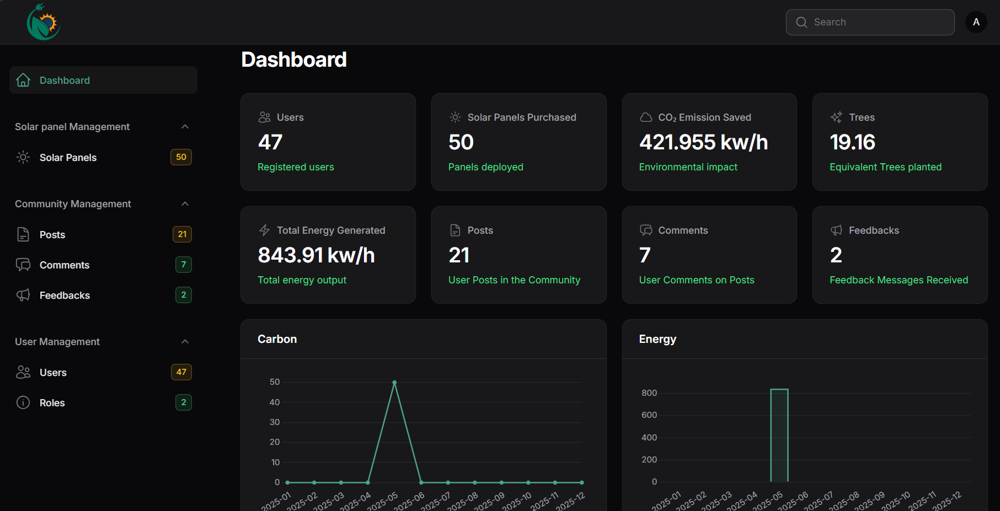

# SHMANSOON

ShamSoon enhances solar energy efficiency in Egypt using a **deep learning-based fault detection system** and a **dual-axis solar tracking mechanism** for maximum energy capture. It includes a mobile app with community engagement, real-time weather updates, and maintenance recommendations.

---

## Prerequisites

* PHP (version 8.1 or higher recommended)
* Laravel Framework (10.0^)
* Docker (for Laravel Sail)
* Git
* Composer

---

## Installation

Follow these steps to set up the project locally:

### 1. Clone the repository:

```bash
git clone https://github.com/shroukelzoghby/ShamSoon.git
cd ShamSoon
``` 

### 2. Install Dependencies:

```bash
composer install
``` 

### 3. Set Up Environment File:

* Copy the *.env.example* file to *.env*:

```bash
cp .env.example .env
``` 

* Update the .env file with your configurations:

```env
DB_DATABASE=your_database_name
DB_USERNAME=your_database_username
DB_PASSWORD=your_database_password```
``` 
* And other necessary credentials

### 4. Generate Application Key:

```bash
php artisan key:generate
``` 
---

## Running the Project

### 1. Start Docker Containers with Laravel Sail:
* Run the following command to start all services (Laravel, MySQL, Redis, phpMyAdmin):

```bash
./vendor/bin/sail up -d
``` 
* If Sail is not installed, you can install it first:

```bash
composer require laravel/sail --dev
php artisan sail:install
``` 

### 2. Run Migrations:

* Create the database tables with seeder:

```bash
./vendor/bin/sail artisan migrate --seed
``` 
---
## Access Dashboard :
* URL: http://localhost:80/admin
* Email: admin@admin.com
* Password: admin

<p align="center">
  <a href="https://github.com/shroukelzoghby/ShamSoon.git" target="_blank">
    
  </a>
</p>


